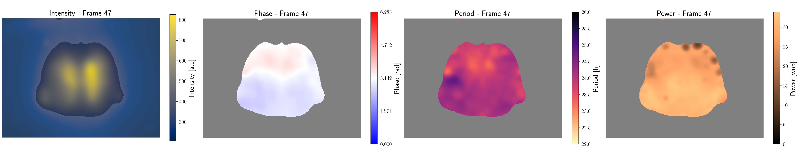

# SpyBOAT - Spatial pyBOAT

[](https://anaconda.org/conda-forge/spyboat)
[![European Galaxy server](https://img.shields.io/badge/usegalaxy-.eu-brightgreen?logo=data:image/png;base64,iVBORw0KGgoAAAANSUhEUgAAABgAAAASCAYAAABB7B6eAAAABGdBTUEAALGPC/xhBQAAACBjSFJNAAB6JgAAgIQAAPoAAACA6AAAdTAAAOpgAAA6mAAAF3CculE8AAAACXBIWXMAAAsTAAALEwEAmpwYAAACC2lUWHRYTUw6Y29tLmFkb2JlLnhtcAAAAAAAPHg6eG1wbWV0YSB4bWxuczp4PSJhZG9iZTpuczptZXRhLyIgeDp4bXB0az0iWE1QIENvcmUgNS40LjAiPgogICA8cmRmOlJERiB4bWxuczpyZGY9Imh0dHA6Ly93d3cudzMub3JnLzE5OTkvMDIvMjItcmRmLXN5bnRheC1ucyMiPgogICAgICA8cmRmOkRlc2NyaXB0aW9uIHJkZjphYm91dD0iIgogICAgICAgICAgICB4bWxuczp0aWZmPSJodHRwOi8vbnMuYWRvYmUuY29tL3RpZmYvMS4wLyI+CiAgICAgICAgIDx0aWZmOlJlc29sdXRpb25Vbml0PjI8L3RpZmY6UmVzb2x1dGlvblVuaXQ+CiAgICAgICAgIDx0aWZmOkNvbXByZXNzaW9uPjE8L3RpZmY6Q29tcHJlc3Npb24+CiAgICAgICAgIDx0aWZmOk9yaWVudGF0aW9uPjE8L3RpZmY6T3JpZW50YXRpb24+CiAgICAgICAgIDx0aWZmOlBob3RvbWV0cmljSW50ZXJwcmV0YXRpb24+MjwvdGlmZjpQaG90b21ldHJpY0ludGVycHJldGF0aW9uPgogICAgICA8L3JkZjpEZXNjcmlwdGlvbj4KICAgPC9yZGY6UkRGPgo8L3g6eG1wbWV0YT4KD0UqkwAAAn9JREFUOBGlVEuLE0EQruqZiftwDz4QYT1IYM8eFkHFw/4HYX+GB3/B4l/YP+CP8OBNTwpCwFMQXAQPKtnsg5nJZpKdni6/6kzHvAYDFtRUT71f3UwAEbkLch9ogQxcBwRKMfAnM1/CBwgrbxkgPAYqlBOy1jfovlaPsEiWPROZmqmZKKzOYCJb/AbdYLso9/9B6GppBRqCrjSYYaquZq20EUKAzVpjo1FzWRDVrNay6C/HDxT92wXrAVCH3ASqq5VqEtv1WZ13Mdwf8LFyyKECNbgHHAObWhScf4Wnj9CbQpPzWYU3UFoX3qkhlG8AY2BTQt5/EA7qaEPQsgGLWied0A8VKrHAsCC1eJ6EFoUd1v6GoPOaRAtDPViUr/wPzkIFV9AaAZGtYB568VyJfijV+ZBzlVZJ3W7XHB2RESGe4opXIGzRTdjcAupOK09RA6kzr1NTrTj7V1ugM4VgPGWEw+e39CxO6JUw5XhhKihmaDacU2GiR0Ohcc4cZ+Kq3AjlEnEeRSazLs6/9b/kh4eTC+hngE3QQD7Yyclxsrf3cpxsPXn+cFdenF9aqlBXMXaDiEyfyfawBz2RqC/O9WF1ysacOpytlUSoqNrtfbS642+4D4CS9V3xb4u8P/ACI4O810efRu6KsC0QnjHJGaq4IOGUjWTo/YDZDB3xSIxcGyNlWcTucb4T3in/3IaueNrZyX0lGOrWndstOr+w21UlVFokILjJLFhPukbVY8OmwNQ3nZgNJNmKDccusSb4UIe+gtkI+9/bSLJDjqn763f5CQ5TLApmICkqwR0QnUPKZFIUnoozWcQuRbC0Km02knj0tPYx63furGs3x/iPnz83zJDVNtdP3QAAAABJRU5ErkJggg==)](https://usegalaxy.eu/root?tool_id=toolshed.g2.bx.psu.edu/repos/iuc/spyboat/spyboat)


Small pipeline to wavelet analyze 3D-Stacks (time,Y,X) representing an oscillatory field 
based on the analysis tools provided by [pyBOAT](https://github.com/tensionhead/pyBOAT). The supplied input
movie gets analyzed pixel by pixel along the time axis, yielding up to
four output movies:

- phase movie
- period movie
- amplitude movie
- power movie

A snapshot of a typical output of the pipeline might look like this:

<sub>Example data graciously provided by Jihwan Myung, GIMBC Taipei Medical University</sub>


      
From left to right: Intensity of the blurred and down-sampled input; Phasefield; Periods and Amplitude 

The results show the instantaneous spatial distributions of the key observables characterizing
every oscillatory dynamics.
This is the complete 3D-analogue to the results for univariate time-series provided by pyBOAT.

## General Usage Tips 

For new users and/or exploratory data analysis it is advisable to first analyse at least a 
few 1D time-series (e.g. ROI tracks) with [pyBOAT](https://github.com/tensionhead/pyBOAT), which
gets automatically installed along SpyBOAT.
This allows to sanity check the key parameters
of the time-frequency analysis:

 - period range
 - sinc filter cut-off period
 - amplitude normalization window size (optional)
 - sampling interval 
 
 before starting the computationally costly 3D stack transforms with SpyBOAT. 


### Spatial downsampling and smoothing

Typically bio-image data aquired by tissue microscopy has much higher spatial resolution 
than temporal resolution. To save computing time and ressources, it 
is advisable to **spatially downscale** the input movie. SpyBOAT offers a simple rescaling based
on a scaling factor in %.

Spatial(!) smoothing is important, as SpyBOAT operates on every time-series *behind* a pixel (so along
the time axis of the stack). Individual pixels tend to be quite noisy, so to faithfully resolve the 
larger structures of an oscillatory field SpyBOAT offers a standard Gaussian blur. For optimal results,
the user might want to smooth (and/or downsample) her input movie beforehand (e.g. with Fiji), and then inspect the signals
sitting on a few single pixels. Or even better, extract a few single-pixel signals, and run them through pyBOAT. If the results
are satisfying there, the transform of the whole movie with SpyBOAT should also work well.

### Masking

Often not everywhere in space an oscillatory signal can be found, hence masking the results 
**after** the transformation is an important step. SpyBOAT provides some simple masking capabilities,
but the user is welcome to work with the raw output and devise a masking strategy most suitable for her needs.

This repository also provides a Fiji plugin in ```/local-scripts/mask_wmovie_ij.py```, which allows for interactive
masking.

## Galaxy Web Server

SpyBOAT is ready for use on the [imaging.usegalaxy.eu platform](https://usegalaxy.eu/root?tool_id=/spyboat), you don't even need a login to try it out!

### For Server Admins: Installing SpyBOAT as a Galaxy Tool

SpyBOAT is available in the [toolshed](https://toolshed.g2.bx.psu.edu/view/iuc/spyboat/639d2031d998),
so it can be easily installed on your Galaxy instance. You can also directly see the ```/galaxy-tool``` folder. 
There is a ```run_tests.sh``` which produces all SpyBOAT outputs in the cwd. 

## Python scripting interface

Install SpyBOAT via pip: 

```bash pip3 install spyboat```

or conda:

```bash
conda config --add channels conda-forge
conda install spyboat
```
The ```scripting-template.py``` in the root of this repository
showcases the analysis with the example ```spyboat.datasets```.
